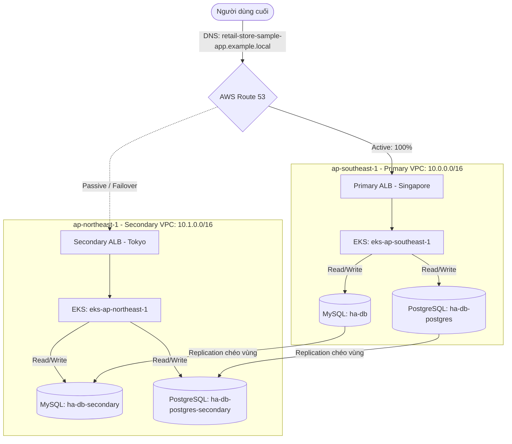

# AWS Multi-Region High Availability & Automated Failover Infrastructure (NT114)

Đây là kho lưu trữ mã nguồn cấu trúc hạ tầng (Infrastructure as Code - IaC) và cấu hình triển khai GitOps (Kustomize/Flux CD) cho đồ án môn **NT114**. Dự án xây dựng một kiến trúc đa vùng địa lý (**Multi-Region Active-Passive / Warm Standby**) cho ứng dụng mẫu **Retail Store Sample App**, giúp tự động phát hiện sự cố cơ sở dữ liệu và chuyển đổi vùng hoạt động tự động (**Automated Failover**) nhằm đạt trạng thái Zero-Downtime.

---

## 📋 Mục Lục
- [1. Sơ đồ Kiến trúc Hệ thống](#1-sơ-đồ-kiến-trúc-hệ-thống)
- [2. Cấu trúc Thư mục Repository](#2-cấu-trúc-thư-mục-repository)
- [3. Chi tiết Hạ tầng (Terraform IaC)](#3-chi-tiết-hạ-tầng-terraform-iac)
- [4. Cấu hình Triển khai GitOps (Flux CD & Kustomize)](#4-cấu-hình-triển-khai-gitops-flux-cd--kustomize)
- [5. Hướng dẫn Triển khai Hạ tầng](#5-hướng-dẫn-triển-khai-hạ-tầng)
- [6. Cơ chế Tự động hóa Failover (Disaster Recovery)](#6-cơ-chế-tự-động-hóa-failover-disaster-recovery)
- [7. Hệ thống CI/CD Workflows](#7-hệ-thống-cicd-workflows)

---

## 1. Sơ đồ Kiến trúc Hệ thống

Hệ thống hoạt động ở chế độ Active-Passive chéo hai vùng địa lý AWS:
*   **Vùng chính (Primary Region)**: Singapore (`ap-southeast-1`) - Xử lý 100% lưu lượng người dùng bình thường.
*   **Vùng dự phòng (Secondary Region)**: Tokyo (`ap-northeast-1`) - Trạng thái Warm Standby, sẵn sàng thăng cấp và nhận tải khi có sự cố.



---

## 2. Cấu trúc Thư mục Repository

```text
.
├── .github/workflows/          # Các luồng tự động hóa CI/CD của GitHub Actions
│   ├── deploy-env.yml          # Triển khai ứng dụng theo môi trường cụ thể
│   ├── failover-tokyo.yml      # Tự động hóa kịch bản Failover qua vùng Tokyo
│   ├── promotion-guard.yml     # Quản lý luồng duyệt thăng cấp môi trường (test -> staging -> prod)
│   └── upsert-version-set.yml  # Tự động cập nhật phiên bản manifest trong GitOps
├── deploy/                     # Cấu hình Kubernetes Manifests (Kustomize & Flux CD)
│   ├── base/                   # Định nghĩa manifests dùng chung cho các microservices
│   ├── clusters/               # Cấu hình chi tiết cho từng môi trường (test, staging, prod, prod-secondary)
│   ├── flux-system/            # Cấu hình Flux CD Bootstrap cho cụm Primary (Singapore)
│   └── flux-system-secondary/  # Cấu hình Flux CD Bootstrap cho cụm Secondary (Tokyo)
├── docs/                       # Tài liệu hướng dẫn kỹ thuật chi tiết
├── infra/terraform/            # Mã nguồn hạ tầng AWS sử dụng Terraform (IaC)
│   ├── modules/                # Các Terraform Modules con (VPC, EKS, RDS, Route53, Lambda, OIDC)
│   ├── main.tf                 # Cấu hình chính (chứa tài nguyên Singapore & Tokyo)
│   ├── variables.tf            # Các tham số đầu vào hạ tầng
│   └── outputs.tf              # Dữ liệu xuất đầu ra (endpoints, ARNs, names)
└── scripts/                    # Scripts tiện ích vận hành hệ thống
```

---

## 3. Chi tiết Hạ tầng (Terraform IaC)

Hạ tầng được quản lý hoàn toàn bằng **Terraform** tập trung tại thư mục `infra/terraform/`:

*   **Mạng lưới (VPC & Subnets)**:
    *   **Singapore VPC (`10.0.0.0/16`)**: Gồm 2 Public Subnets (cho ALB chính) và 2 Private Subnets (cho EKS Node Group và Database chính).
    *   **Tokyo VPC (`10.1.0.0/16`)**: Thiết lập tương tự với dải IP riêng biệt để tránh xung đột IP trong tương lai.
*   **Kubernetes (EKS)**:
    *   Tự động hóa triển khai cụm EKS tại cả 2 vùng địa lý với AWS EKS Access Entries được định nghĩa tĩnh, cấp quyền admin cho tài khoản triển khai và GitHub Actions CI/CD runner.
*   **Cơ sở dữ liệu (RDS Multi-Region Replica)**:
    *   Sử dụng **MySQL** (lớp catalog/cart) và **PostgreSQL** (lớp orders).
    *   Read Replicas đặt tại Tokyo nhận dữ liệu đồng bộ chéo vùng từ Singapore. Dữ liệu tại Tokyo được mã hóa bằng KMS Key chuyên dụng tạo tại khu vực `ap-northeast-1`.
*   **Định tuyến (Route 53 Failover Routing)**:
    *   Cấu hình bản ghi DNS Failover dạng **Active-Passive**.
    *   Thiết lập Route53 Health Checks giám sát trực tiếp ALB chính tại Singapore để tự động định tuyến sang Tokyo khi có sự cố.

---

## 4. Cấu hình Triển khai GitOps (Flux CD & Kustomize)

Ứng dụng storefront được đồng bộ liên tục bằng phương pháp GitOps thông qua **Flux CD** kết hợp với **Kustomize**:

*   **Base (`deploy/base`)**: Chứa định nghĩa Deployment, Service, ServiceAccount chuẩn của các microservices (`ui`, `catalog`, `carts`, `checkout`, `orders`).
*   **Overlays (`deploy/clusters`)**:
    *   `test`, `staging`: Môi trường thử nghiệm độc lập.
    *   `prod`: Chạy chính thức tại cụm Singapore, kết nối trực tiếp đến Primary RDS Databases.
    *   `prod-secondary`: Dành riêng cho cụm dự phòng tại Tokyo, cấu hình ghi đè biến môi trường cơ sở dữ liệu (`RETAIL_ORDERS_PERSISTENCE_ENDPOINT`) hướng về các database đã thăng cấp cục bộ ở Tokyo.

---

## 5. Hướng dẫn Triển khai Hạ tầng

### Yêu cầu chuẩn bị
*   AWS CLI được cấu hình với tài khoản có quyền Admin.
*   Terraform CLI (Phiên bản `>= 1.5`).
*   Kubectl CLI & Flux CLI.

### Các bước triển khai chi tiết
1.  **Khởi tạo Terraform**:
    ```bash
    cd infra/terraform
    terraform init
    ```
2.  **Xem trước kế hoạch tạo hạ tầng**:
    ```bash
    terraform plan -out=tfplan
    ```
3.  **Áp dụng cấu hình hạ tầng lên AWS**:
    ```bash
    terraform apply tfplan
    ```
4.  **Xuất các thông số đầu ra**:
    ```bash
    terraform output -json > outputs.json
    ```

---

## 6. Cơ chế Tự động hóa Failover (Disaster Recovery)

Khi cụm Database chính tại Singapore gặp sự cố vật lý hoặc lỗi kết nối, hệ thống tự động phục hồi chéo vùng thông qua luồng tự động hóa sau:

```text
[Sự cố RDS Database] 
   └──> [RDS Event Subscription] (Phát hiện trạng thái sập/lỗi)
         └──> [SNS Topic] (rds-failover-events)
               └──> [Lambda Function] (rds-promote-replica)
                     ├──> 1. Thăng cấp MySQL & PG Replicas ở Tokyo lên thành Master (Standalone)
                     └──> 2. Gọi GitHub Repository Dispatch API (sự kiện: auto-failover-trigger)
                               └──> [Actions Workflow] (failover-tokyo.yml)
                                     ├──> Bootstrap và kích hoạt Flux CD trên EKS Tokyo
                                     └──> Đồng bộ config mới & định tuyến traffic qua Tokyo ALB
```

### Cách kích hoạt kiểm thử Failover thủ công
Bạn có thể giả lập lỗi hoặc chủ động trigger quá trình Failover sang Tokyo bằng cách kích hoạt sự kiện repository dispatch từ GitHub CLI:
```bash
gh api repos/AndrewDoan01/aws-failover-zero-downtime/dispatches \
  -F event_type=auto-failover-trigger
```

---

## 7. Hệ thống CI/CD Workflows

Thư mục `.github/workflows/` quản lý toàn bộ vòng đời phát triển và phục hồi lỗi của dự án:

| Tên Workflow | Mô tả chức năng |
| :--- | :--- |
| `deploy-env.yml` | Thực hiện triển khai workload, cấu hình các biến môi trường riêng biệt lên các namespace tương ứng trên cụm EKS. |
| `failover-tokyo.yml` | Chạy tự động khi nhận tín hiệu dispatch từ Lambda. Thực hiện thăng cấp cụm EKS Tokyo từ trạng thái Warm Standby lên Active, bootstrap cấu hình Flux CD trỏ tới cơ sở dữ liệu mới. |
| `promotion-guard.yml` | Triển khai cơ chế chất lượng/bảo mật. Chạy các bài kiểm thử khói (smoke tests) trên môi trường Staging, yêu cầu phê duyệt thủ công (Manual Gate Approval) trước khi được thăng cấp (Promote) lên Production. |
| `upsert-version-set.yml` | Đảm bảo tính nhất quán của hệ thống GitOps. Tự động commit các thẻ phiên bản image mới do quá trình build tạo ra vào các tệp manifest tương ứng trong nhánh deployment. |
| `secret-scan.yml` | Quét phát hiện mã khóa (secrets, tokens, credentials) nhạy cảm bằng GitLeaks để đảm bảo an toàn thông tin mã nguồn. |

---

> [!IMPORTANT]
> **Lưu ý bảo mật**: Không bao giờ commit các tệp chứa thông tin nhạy cảm như `terraform.tfstate`, `outputs.json` hay các file chứa credentials cá nhân lên GitHub. Hãy chắc chắn rằng `.gitignore` đã chặn các tệp này trước khi thực hiện push code.
